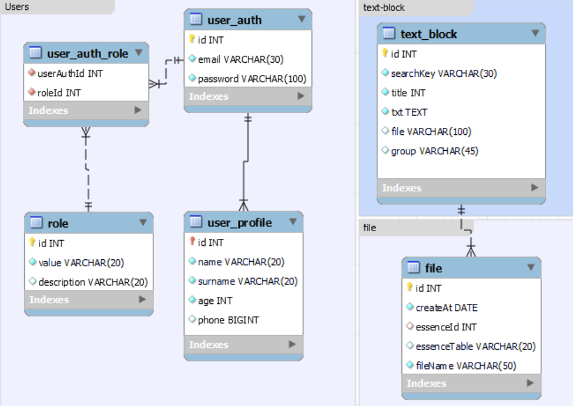

# NestJS Project. Step_3.
#### Typescrypt, TypeORM

<p align="center">
  <a href="http://nestjs.com/" target="blank"></a>
</p>

## Task

1. Создать проект nestJs + Typescript.
2. Создать необходимый код для авторизации и работы с ролями.
   ВАЖНО!
   Покройте максимально код комментариями, чтобы вам всегда легко было к нему вернуться. Потому что тема для неопытного разработчика часто забывается.


3. Создать код для работы с профилем.
   ВАЖНО!
   Создаем отдельные таблицы:
   * user (для авторизации - логин/mail, пароль и пр.)
   * profile для профиля (фамилия, телефон, и пр - полный перечень полей на ваше усмотрение).<br>
   Связь у таблиц 1 к 1.
    <br><br>
    3.1. У нас должен  быть эндпоинт для регистрации (поучает и пароль и ФИО и телефон и пр). Его будет обрабатывать код, относящийся к профайлу. Код профайла будет обращаться к коду авторизации, получать ID_user и использовать его для создания профиля.
Благодаря этому код авторизации будет неизменным полностью, какие бы данные в профиле не были. И проще использовать в других проектах. Особенно ценно станет при переходе к микросервисам.<br>
    <br>
    3.2. Для удаления и редактирования поставить проверку прав. Только себя или админ.


4. Создать модуль "текстовый блок".
   ```
   Для чего используется на практике:
   У вас на главной странице сайта есть текст-приветствие. А еще есть блок из трех преимуществ (У каждого картинка, текст, заголовок). Еще какой-то блок с текущей акцией и пр.
   Фронтэндер может все эти тексты вшить в код, но лучше, чтобы админ мог это редактировать.
   ```
   Таким образом необходимы CRUD-методы для управления такими блоками
- уникальное название для поиска (например, main-hero-text)
- название
- картинка
- текст
- ГРУППА - (например, main-page - чтобы все блоки главной страницы или другой группы фронтэнд мог получать одним запросом)<br><br>
  4.1. Добавление, редактирование, удаление доступно только админу.<br><br>
  4.2. В получении списка среди прочего должна быть возможность фильтрации по группе<br>


5. Написать отдельный модуль по сохранению файлов
   ```
   Для чего используется на практике:
   Пользователь заполняет форму фильму создания фильма.
   К фильму добавляется 5 скриншотов.
   Эти скриншоты пользователь добавляет еще до нажатия кнопки сохранить.
   Но при этом мы ему сразу хотим отобразить превью этих скриншотов.
   ```
   5.1. Сохранение файлов, в том числе в БД.
Среди прочего:
- дата добавления createdAt
- сущность, где используется essenceTable
- id где используется essenceId<br><br>
  5.2. Добавить эндпоинт по которому можно удалить все лишние файлы
- прошло больше часа с момента создания
- нигде не используется (essenceId/essenceTable пустые)
  essenceTable + essenceId могут быть, например, такие: profile 17, profile 19, film 23, film 17 (одновременно только одна пара значений само собой записана или null)<br><br>
  5.3. сделать п.7.


6. Сделать возможность использовать файловый модуль в п.5
   Файл приходит вместе с остальными данными. Получается модуль текстового блока должен вызвать в том числе сохранение файла из модуля 6. Цель - вся работа с файлами должна быть сосредоточена в одном месте.
   Обращаем внимание, что при редактировании файл - не обязательное поле.
   Обращаем внимание, что  удалении блока файл перестает использоваться

## EEr-Diagram DB
<p align="center">
  </a>
</p>
## Installation

```bash
$ npm install
```

## Running the app

```bash
# development
$ npm run start

# watch mode
$ npm run start:dev

# production mode
$ npm run start:prod
```

## License

Nest is [MIT licensed](LICENSE).
